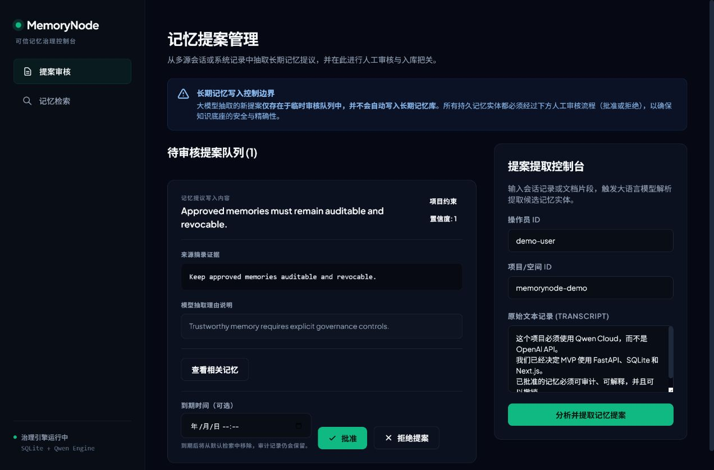
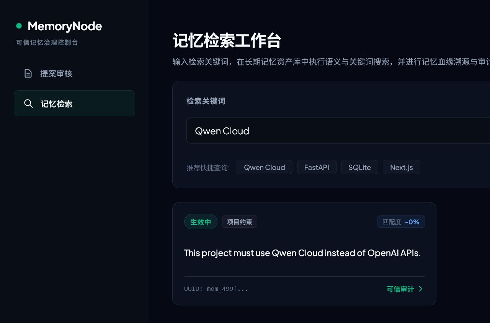
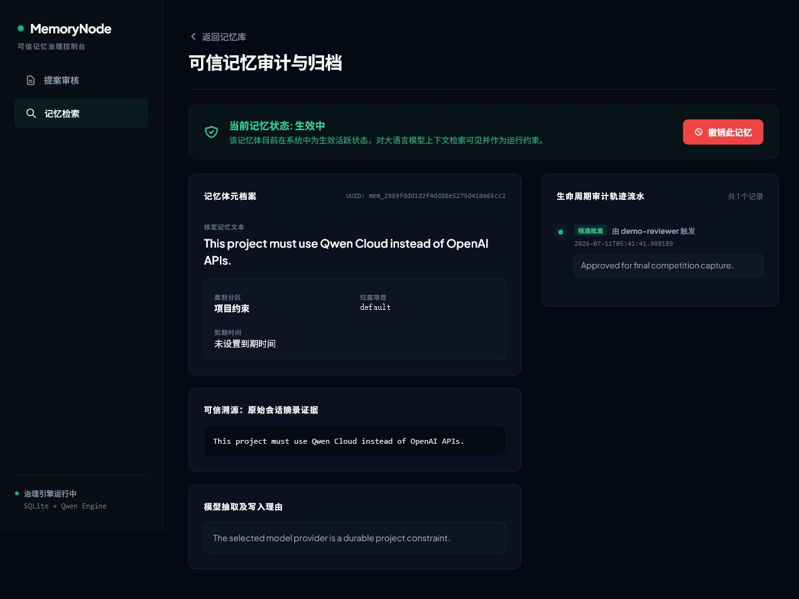
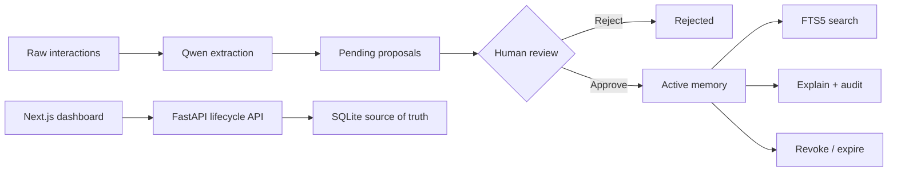

<div align="center">

# MemoryNode

### Governed memory for AI agents

Turn raw interactions into human-reviewed, searchable, explainable, and revocable memories—backed by source evidence and a complete audit trail.


</div>

## Why MemoryNode?

Agent memory is often treated as an invisible side effect: a model extracts a statement, stores it indefinitely, and gives users little control over why it exists or how to remove it.

MemoryNode makes durable memory an explicit governance decision:

```text
extract → approve / reject → search → explain → revoke
```

- **Evidence before persistence** — extraction creates proposals, never trusted memories.
- **Human decision before trust** — every durable memory requires explicit approval.
- **Auditability after every change** — source, rationale, reviewer actions, expiry, replacement, and revocation remain traceable.

MemoryNode is a memory layer—not a chatbot and not an agent framework.

## Product tour

| Review model proposals | Retrieve trusted memory |
| --- | --- |
|  |  |

### Explain every memory



The dashboard exposes the memory content, lifecycle state, source quote, extraction rationale, reviewer decision, expiry metadata, replacement links, and audit events.

## Governance capabilities

| Capability | Contract |
| --- | --- |
| Proposal extraction | Qwen-compatible extraction turns raw messages into structured pending proposals. |
| Human review | Reviewers approve useful proposals or reject unsafe and irrelevant ones. |
| Trusted retrieval | SQLite FTS5 searches active approved memories by default. |
| Explanation | Every memory remains linked to its source, proposal, rationale, and events. |
| Revocation | Revoked memories leave default search without losing their history. |
| Supervised supersession | Related memories are candidates; the reviewer explicitly selects any memory to replace. |
| Optional expiration | Due active memories expire on relevant requests and remain auditable. |

> Related-memory candidates are not automatic conflict arbitration. Expiration is request-driven, not a background scheduler.

## Architecture



The backend owns all lifecycle transitions. SQLite stores sources, proposals, memories, and audit events; FTS5 indexes only the memories available to retrieval.

## Tech stack

- **Model integration:** Qwen-compatible Chat Completions or Responses API
- **Backend:** Python, FastAPI, Pydantic, SQLAlchemy
- **Storage and search:** SQLite, SQLite FTS5
- **Dashboard:** Next.js, React
- **Verification:** Pytest, Next.js production build

## Run locally

MemoryNode 0.7.0 ships the SDK, stdio and local shared Streamable HTTP MCP
servers, FastAPI backend, and static
governance console in one Python distribution:

```bash
uv tool install memorynode
memorynode init
memorynode start
memorynode status
memorynode doctor
memorynode stop
```

Open `http://127.0.0.1:3000/proposals/`. Both services are Python processes
bound to `127.0.0.1`; defaults are API `8000` and console `3000`. Override them
with `--api-port`/`--console-port`, `MEMORYNODE_API_PORT`/
`MEMORYNODE_CONSOLE_PORT`, or `config.toml`. The ports must differ. Installed
runtime commands do not need a checkout, Node.js, npm, `node_modules`, or
`.next`. Existing `[source]` configuration is accepted but ignored at runtime.

For MCP clients, use `memorynode mcp`; stdout remains protocol-only:

```json
{"mcpServers":{"memorynode":{"command":"memorynode","args":["mcp"]}}}
```

For multiple local clients, start the FastAPI service first and run the shared
endpoint in a separate foreground terminal. `memorynode init` prints a
high-entropy bearer token once and persists only its SHA-256 hash in local
`config.toml`; store that printed value securely.

```powershell
memorynode start
memorynode mcp --transport http --host 127.0.0.1 --port 8765
```

Clients connect to `http://127.0.0.1:8765/mcp` with
`Authorization: Bearer <token>`. Missing or invalid tokens are rejected before
MCP tools or resources run. Existing installations without a token can rotate
one explicitly with `memorynode mcp --transport http --print-token-once`.
The HTTP server binds only to `127.0.0.1`; there is no LAN exposure, cloud
authentication, system service, or high-throughput multi-user guarantee.

Sanitized MCP connection and call summaries are written locally to
`MEMORYNODE_HOME/logs/mcp.log`. They contain operation names, outcomes, timing,
and a token fingerprint only—never a bearer token, Authorization header,
memory content, query, request parameters, or response. The static governance
console intentionally has no MCP panel yet: it cannot safely read local log
files without a UI/API expansion, so that overview is deferred.

### Source development only

```bash
git clone https://github.com/unnoderes/MemoryNode.git
cd MemoryNode
```

Set the Qwen-compatible endpoint, model, and API key as environment variables.
The installed runtime does not load repository `.env` files; keep real
credentials out of version control and out of CLI diagnostics.

### 2. Start the backend

```bash
cd backend
python -m pip install -r requirements.txt
python -m uvicorn app.main:app --reload
```

The API runs at `http://localhost:8000`; verify it with `GET /health`.

### 3. Start the dashboard

```bash
cd frontend
npm install
npm run dev
```

Open `http://localhost:3000/proposals`.

## Try the governed-memory flow

1. Paste a transcript into the proposal console and select **Extract**.
2. Inspect the content, type, confidence, source quote, and rationale.
3. Approve one proposal and reject another.
4. Search the approved memory from the memory library.
5. Open its detail page to inspect evidence and audit events.
6. Revoke it, then confirm it no longer appears in default search.

For an optional governance extension, load related memories and explicitly select one to supersede, or assign a future expiry during approval.

## Operating the local product

`memorynode init` creates platform-appropriate config, data, log, runtime,
backup, and export directories. Set `MEMORYNODE_HOME` to place all of those
under one isolated directory (useful for testing or a portable local setup).
The local database is SQLite with FTS5; it is never accessed directly by the
SDK or MCP server.

| Command | Use |
| --- | --- |
| `memorynode start`, `stop`, `restart`, `status` | Manage only the API and console processes it recorded and verified. |
| `memorynode doctor` | Read-only installation, process, package, database, and configuration checks; secret values are never printed. |
| `memorynode backup [--output PATH]` | Create a SQLite snapshot; treat it as sensitive memory data. |
| `memorynode restore PATH --confirm` | Replace the stopped local database from a backup. |
| `memorynode export [--output PATH]` | Create a JSONL transfer file; it may contain sensitive memory data. |
| `memorynode import PATH --confirm` | Import only while stopped; conflicts fail without partial writes. |
| `memorynode version` | Print the installed distribution version. |

Use `memorynode --help` and `memorynode <command> --help` for flags. Restore
and import require a stopped, verified local installation and explicit
confirmation. Backup/export paths should be access-controlled and excluded from
sync or source-control tools. To remove an installation, stop it, retain or
securely remove its `MEMORYNODE_HOME` data according to your policy, then use
the installer that created it: `uv tool uninstall memorynode`, `pipx uninstall
memorynode`, or `python -m pip uninstall memorynode`.

### Governance contract

Agent proposals are always pending by default. A reviewer approves or rejects
them in the console or through the lifecycle API. Search returns active,
effective memories by default; revoke, expiry, and supersession retain audit
history but remove a memory from default retrieval. Related memories are only
reviewer candidates, never automatic conflict decisions. Expiry is evaluated by
relevant requests—there is no background scheduler. MCP governance tools are
hidden unless their local TOML boolean is explicitly enabled.

### Privacy, security, and support

Services accept only `127.0.0.1`. The console origin is exact and loopback-only;
the static console rejects path traversal. HTTP MCP requires a bearer token and
persists only its SHA-256 hash. It is intentionally not a LAN service, cloud
SaaS, system service, or high-throughput multi-user server. See
[SECURITY.md](SECURITY.md) for data and log handling, and
[TROUBLESHOOTING.md](TROUBLESHOOTING.md) for recovery and diagnostics.

## API surface

| Method | Endpoint | Purpose |
| --- | --- | --- |
| `GET` | `/health` | Service health |
| `POST` | `/v1/proposals/extract` | Extract pending proposals with Qwen |
| `POST` | `/v1/proposals` | Create a manual proposal |
| `GET` | `/v1/proposals` | List proposals by status |
| `GET` | `/v1/proposals/{id}` | Read one proposal |
| `GET` | `/v1/proposals/{id}/related-memories` | Load reviewer-facing replacement candidates |
| `POST` | `/v1/proposals/{id}/approve` | Approve, optionally expire or supersede |
| `POST` | `/v1/proposals/{id}/reject` | Reject a proposal |
| `GET` | `/v1/sources/{id}` | Read source evidence |
| `GET` | `/v1/events` | Read recent audit events |
| `GET` | `/v1/events/{id}` | Read one audit event |
| `GET` | `/v1/memories` | List memories by lifecycle filters |
| `GET` | `/v1/memories/search` | Search active memories with FTS5 |
| `GET` | `/v1/memories/{id}` | Read memory state |
| `GET` | `/v1/memories/{id}/explain` | Read evidence, relationships, and events |
| `POST` | `/v1/memories/{id}/revoke` | Revoke an active memory |
| `POST` | `/v1/memories/{id}/feedback` | Record usage feedback without changing memory state |
| `POST` | `/v1/memories/{id}/expiry` | Set future expiry on an active memory |

## Verify

```bash
cd backend
python -m pytest -q

cd ../frontend
npm run build
```

Release artifacts are built with `python scripts/build_release.py`. The command
runs `npm ci`, creates a Next.js static export, stages the single backend source,
builds an sdist and then a wheel from that sdist, and audits both artifacts.
See `RELEASING.md` for the gated publication procedure.

## Scope

This competition prototype intentionally proves the governed-memory contract before adding infrastructure. It includes a local Python SDK, CLI, stdio MCP adapter, and token-protected loopback Streamable HTTP MCP, but does not include Docker deployment, cloud services, LAN exposure, or vector retrieval.

---

<div align="center">

**Models may propose memories. Humans decide what becomes trusted knowledge.**

</div>
