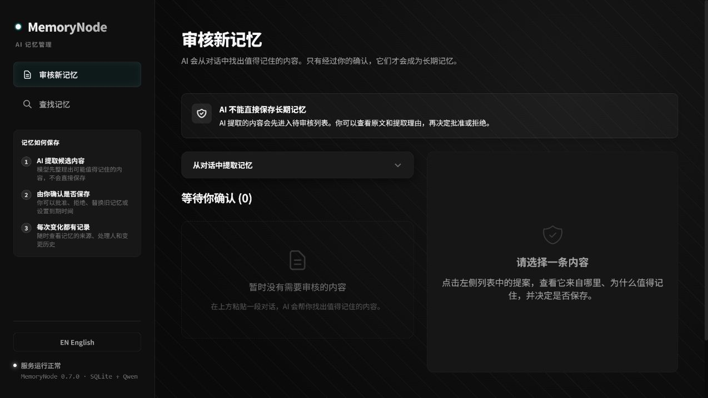
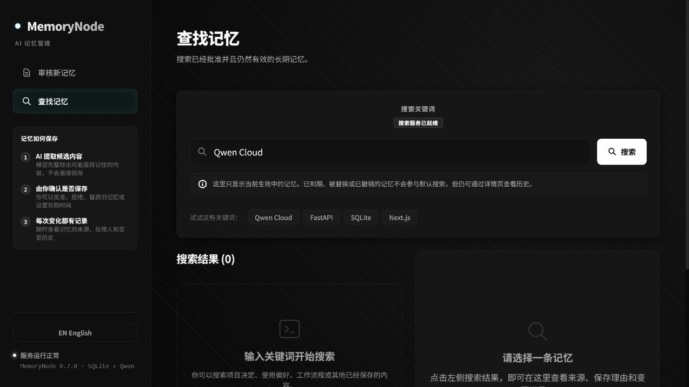
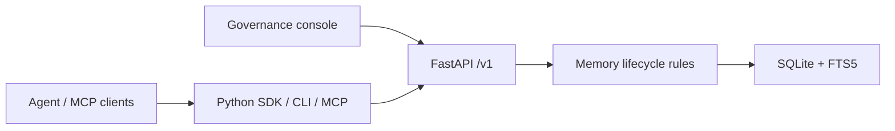

# MemoryNode

[English](README.md) | [简体中文](README.zh-CN.md)

> Give AI a memory it can use—and people a memory they can govern.

MemoryNode is local-first memory infrastructure for AI agents. A model can propose a memory, but it cannot silently turn a conversation into a durable fact. **People decide what is saved.** Once approved, a memory remains searchable, explainable, replaceable, expirable, and revocable.


## In one line

**Propose first. Review before saving. Search with context. Revoke when needed.**

```text
Conversation / content → proposal → human review → active memory → search, explain, audit
                                      ↓
                        reject / revoke / expire / supersede
```

MemoryNode is for local applications that need durable agent memory without handing control to the model. It is not a chatbot, agent framework, vector database, or hosted SaaS.

## What it does

| Need | How MemoryNode handles it |
| --- | --- |
| Stop AI from saving facts on its own | Extracted memories enter a pending review queue by default. |
| Find where a memory came from | Every approved memory keeps its source, proposal, decision, and event history. |
| Keep stale facts out of answers | Revoke, expire, or explicitly supersede a memory. Default search returns effective memories only. |
| Connect several local agents | The Python SDK, CLI, and MCP use the same FastAPI boundary. |
| Keep data local | Services listen on `127.0.0.1`; SQLite is the local source of truth. |

Related memories are reviewer hints, not automatic conflict decisions. Expiry is applied by request; there is no background scheduler.

## See it in action

Review the content, source quote, rationale, and confidence before approving or rejecting a proposal. Model confidence is evidence for a reviewer—not permission to save.



Approved memories are searchable by keyword. Revoked, expired, and superseded memories stay out of default results.



## Quick start

MemoryNode runs as the `memorynode` Python package and requires Python 3.10 or later.

```bash
uv tool install memorynode
memorynode init
memorynode start
memorynode status
```

Open the governance console at <http://127.0.0.1:3000/>. The API defaults to <http://127.0.0.1:8000>.

`memorynode init` creates local configuration and directories and prints the HTTP MCP token once. Store it securely.

```bash
memorynode stop
```

The installed package includes the FastAPI API, governance console, SDK, CLI, stdio MCP, and local HTTP MCP. Everyday use does not require Git, Node.js, or a frontend build.

## Workflow

1. Extract proposals from a conversation, or create a manual proposal through the API.
2. Review its content, type, source quote, rationale, and confidence.
3. Approve it to create an active memory, or reject it without creating one.
4. Search memory and use the explanation endpoint to inspect its source and history.
5. Revoke it, give it an expiry, or approve a newer proposal to replace it when necessary.

Extraction uses a Qwen-compatible endpoint. Set `QWEN_API_KEY`, `QWEN_BASE_URL`, `QWEN_MODEL`, and related variables as needed; see [.env.example](.env.example). Never commit real credentials.

## MCP

### Stdio MCP

Add MemoryNode to your MCP client. Standard output is reserved for MCP protocol frames.

```json
{
  "mcpServers": {
    "memorynode": {
      "command": "memorynode",
      "args": ["mcp"]
    }
  }
}
```

The default tools can propose, search, retrieve, explain, list, and provide feedback. Governance-changing tools—approval, rejection, revocation, supersession, and expiry—are hidden unless a local administrator explicitly enables them.

### Local HTTP MCP

For several local MCP clients, run the shared endpoint in another foreground terminal:

```powershell
memorynode start
memorynode mcp --transport http --host 127.0.0.1 --port 8765
```

Connect to `http://127.0.0.1:8765/mcp` with `Authorization: Bearer <token>`. Only the token hash is persisted. To rotate a lost token and print it once:

```powershell
memorynode mcp --transport http --print-token-once
```

HTTP MCP is loopback-only and checks the token before MCP tools or resources run.

## CLI

| Command | Purpose |
| --- | --- |
| `memorynode init` | Initialize local configuration, data directories, and the HTTP MCP token. |
| `memorynode start` / `stop` / `restart` / `status` | Manage the API and console processes recorded by MemoryNode. |
| `memorynode doctor` | Run read-only checks for installation, configuration, processes, database, and MCP without exposing secrets. |
| `memorynode backup` / `restore` | Back up or restore the local SQLite database. Restore requires a stopped service and `--confirm`. |
| `memorynode export` / `import` | Transfer data as JSONL. Import requires a stopped service and `--confirm`. |
| `memorynode mcp` | Run stdio MCP or token-protected local HTTP MCP. |
| `memorynode version` | Print the installed version. |

Use `memorynode --help` or `memorynode <command> --help` for flags. Backups and exports may contain sensitive source and memory content.

## Architecture



FastAPI `/v1` is the lifecycle boundary. SQLite is the local source of truth and FTS5 provides default keyword search. The SDK and MCP server are API clients; they never access SQLite directly.

The API covers proposals, memories, sources, and audit events: create/extract/review proposals; list/search/explain/revoke/expire memories; and inspect sources and events.

## Security and privacy

- The API, console, and HTTP MCP bind to `127.0.0.1` by default.
- HTTP MCP uses a Bearer Token and persists only its hash.
- Local databases, backups, and JSONL exports may contain source text, proposals, memories, and audit events. Keep them private and out of source control.
- MCP logs contain operation metadata only; they must not contain tokens, Authorization headers, queries, request parameters, or memory content.
- The installed runtime does not automatically load repository `.env` files. Provide credentials through environment variables or an approved local secret mechanism.

## Develop from source

These instructions are for contributors. For regular use, install the package above.

```bash
git clone https://github.com/unnoderes/MemoryNode.git
cd MemoryNode/backend
python -m pip install -r requirements.txt
python -m uvicorn app.main:app --reload
```

In another terminal, run the governance console:

```bash
cd frontend
npm install
npm run dev
```

Verify changes:

```bash
cd backend && python -m pytest -q
cd ../frontend && npm run build
```

Build release artifacts with:

```bash
python scripts/build_release.py
```

## Current scope

MemoryNode focuses on a verifiable local governance loop. It does not currently provide cloud hosting, remote accounts, multitenancy, billing, Docker deployment, LAN exposure, automatic approval, automatic conflict arbitration, vector search, or background expiry scheduling.

## License

[MIT](LICENSE)
