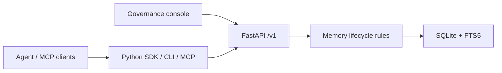

# MemoryNode

[English](README.md) | [简体中文](README.zh-CN.md)

> Give AI a memory it can use—and people a memory they can govern.

MemoryNode is local-first memory infrastructure for AI agents. A model can propose a memory, but it cannot silently turn a conversation into a durable fact. **People decide what is saved.** Once approved, a memory remains searchable, explainable, replaceable, expirable, and revocable.


## In one line

**Propose first. Review before saving. Search with context. Revoke when needed.**

```text
Conversation / content → proposal → human review → active memory → search, explain, audit
                                      ↓
                        reject / revoke / expire / supersede
```

MemoryNode is for local applications that need durable agent memory without handing control to the model. It is not a chatbot, agent framework, vector database, or hosted SaaS.

## What it does

| Need | How MemoryNode handles it |
| --- | --- |
| Stop AI from saving facts on its own | Extracted memories enter a pending review queue by default. |
| Find where a memory came from | Every approved memory keeps its source, proposal, decision, and event history. |
| Keep stale facts out of answers | Revoke, expire, or explicitly supersede a memory. Default search returns effective memories only. |
| Connect several local agents | The Python SDK, CLI, and MCP use the same FastAPI boundary. |
| Keep data local | Services listen on `127.0.0.1`; SQLite is the local source of truth. |

Related memories are reviewer hints, not automatic conflict decisions. Expiry is applied by request; there is no background scheduler.

## See it in action

Review the content, source quote, rationale, and confidence before approving or rejecting a proposal. Model confidence is evidence for a reviewer—not permission to save.


Approved memories are searchable by keyword. Revoked, expired, and superseded memories stay out of default results.


## Standard local workflow

This is the recommended first-use path for one person and one local machine. MemoryNode requires Python 3.10+ and runs entirely on loopback addresses. The installed package includes the FastAPI API, governance console, SDK, CLI, stdio MCP, and local HTTP MCP; everyday use does not require Git, Node.js, or a frontend build.

### 1. Install and initialize

Install the released package, verify the version, then initialize local directories and configuration:

```bash
uv tool install memorynode==0.8.0
memorynode version
memorynode init
```

`memorynode init` prints an HTTP MCP bearer token once. Store it securely if you intend to use the optional local HTTP MCP transport. Stdio MCP does **not** use this token.

### 2. Start the local runtime and open the console

```bash
memorynode start
memorynode status
```

When `status` reports both services as healthy, open the governance console at <http://127.0.0.1:3000/>. The API is at <http://127.0.0.1:8000>.

`memorynode start` manages the API and console processes that it starts: it records their identities, checks their health, and lets `status`, `restart`, and `stop` act on those recorded processes. It never takes over or kills an unknown process that happens to use the same port. If a port is occupied, inspect it deliberately rather than terminating it blindly.

If you previously started a development `uvicorn` manually on port `8000`, stop that known development process before expecting the MCP bootstrap to start the managed console on `3000`. A bootstrap that finds a healthy existing API safely reuses it and does not take ownership of it or start a competing console.

### 3. Configure model extraction only when you need it

`memory_propose` uses a Qwen/OpenAI-compatible model to turn content into one or more pending proposals. Before using it, open **Proposals → Model extraction** in the governance console and enter the Base URL, model, wire API, and API key, then choose **Test connection**.

- Enter provider keys in the local console, never in MCP client configuration, command arguments, or chat.
- Complete `QWEN_API_KEY`, `QWEN_BASE_URL`, and `QWEN_MODEL` environment variables take precedence over saved local settings.
- Manual proposal creation remains available without model configuration; model-backed extraction does not.

### 4. Connect an MCP client

For a stdio-compatible client such as Codex Desktop, add this server configuration and restart the client:

```json
{
  "mcpServers": {
    "memorynode": {
      "command": "uvx",
      "args": ["--from", "memorynode==0.8.0", "memorynode", "mcp", "--ensure-api", "--open-console"]
    }
  }
}
```

`--ensure-api` safely reuses a verified local MemoryNode API or starts the managed API and console when no API is running. `--open-console` opens a browser only when that bootstrap starts the managed pair. If an existing API is reused, open the console URL yourself; the bootstrap will not take over its lifecycle or start a competing console.

For an already installed package, the same configuration can use:

```json
{
  "mcpServers": {
    "memorynode": {
      "command": "memorynode",
      "args": ["mcp", "--ensure-api", "--open-console"]
    }
  }
}
```

### 5. Run the governed-memory loop

Use the following sequence in your MCP client. It is deliberately not an automatic-write workflow.

| Step | MCP action | Expected result |
| --- | --- | --- |
| Inspect safely | `memory_list` or `memory_search` | Reads active memories only; it does not change data. |
| Propose | `memory_propose(content, actor_id, project_id)` | Uses the configured model and creates **pending** proposal(s), never active memory. |
| Review | Governance console → Pending proposals | A human checks content, source quote, rationale, confidence, and related-memory candidates, then approves or rejects. |
| Search | `memory_search(query)` | Returns approved, effective memories by default. |
| Explain | `memory_explain(memory_id)` | Returns the memory, proposal, source, audit events, and replacement links. |
| Feedback | `memory_feedback(...)` | Adds an audit event but does not change memory state. |

Do not enable agent approval, rejection, revocation, supersession, or expiry tools for an initial test. They are hidden by default and require a local administrator to explicitly enable them.

For a first proposal test, ask the MCP client to call `memory_propose` with a disposable `actor_id` such as `codex-manual-test` and `project_id` such as `mcp-smoke-001`, and explicitly say “do not approve this proposal.” Then complete the approval or rejection only in the governance console.

Model extraction can take longer than an MCP client's local request timeout. If `memory_propose` reports a timeout, wait briefly and refresh the Pending proposals page before retrying; the backend may have finished creating a pending proposal after the client stopped waiting. Do not repeatedly submit the same content until you have checked the review queue.

### 6. Day-to-day operation and safe recovery

```bash
memorynode status   # show managed API/console health
memorynode doctor   # read-only installation and configuration checks; never prints secret values
memorynode restart  # restart only verified managed processes
memorynode stop     # stop only verified managed processes
```

Backups and exports can contain source text, proposals, memories, and audit events. Treat them as sensitive. See [TROUBLESHOOTING.md](TROUBLESHOOTING.md) for port conflicts, model configuration, and recovery guidance.

## MCP transport reference

### Stdio MCP

Use the configuration in step 4 above for the normal one-client workflow. Standard output is reserved for MCP protocol frames; operational messages are written to standard error.

The stdio bootstrap never starts HTTP MCP, generates an HTTP token, changes ports, kills unknown processes, or creates a competing runtime. If a client explicitly sets `MEMORYNODE_API_URL`, it must be the exact local origin `http://127.0.0.1:<port>` and its `/health` response must identify MemoryNode. Otherwise bootstrap refuses instead of redirecting to a different instance.

Configure model providers and keys in the local governance console (or documented local environment variables), never in MCP configuration or command arguments. Default tools can propose, search, retrieve, explain, list, and provide feedback. Governance-changing tools—approval, rejection, revocation, supersession, and expiry—are hidden unless a local administrator explicitly enables them.

### Local HTTP MCP

Use this optional, loopback-only transport only when several local MCP clients need to share one endpoint. It is not required for the standard Codex/Desktop stdio setup. Run the shared endpoint in another foreground terminal:

```powershell
memorynode start
memorynode mcp --transport http --host 127.0.0.1 --port 8765
```

Connect to `http://127.0.0.1:8765/mcp` with `Authorization: Bearer <token>`. Only the token hash is persisted. To rotate a lost token and print it once:

```powershell
memorynode mcp --transport http --print-token-once
```

HTTP MCP is loopback-only and checks the token before MCP tools or resources run.

## CLI

| Command | Purpose |
| --- | --- |
| `memorynode init` | Initialize local configuration, data directories, and the HTTP MCP token. |
| `memorynode start` / `stop` / `restart` / `status` | Manage the API and console processes recorded by MemoryNode. |
| `memorynode doctor` | Run read-only checks for installation, configuration, processes, database, and MCP without exposing secrets. |
| `memorynode backup` / `restore` | Back up or restore the local SQLite database. Restore requires a stopped service and `--confirm`. |
| `memorynode export` / `import` | Transfer data as JSONL. Import requires a stopped service and `--confirm`. |
| `memorynode mcp` | Run stdio MCP or token-protected local HTTP MCP. |
| `memorynode version` | Print the installed version. |

Use `memorynode --help` or `memorynode <command> --help` for flags. Backups and exports may contain sensitive source and memory content.

## Architecture



FastAPI `/v1` is the lifecycle boundary. SQLite is the local source of truth and FTS5 provides default keyword search. The SDK and MCP server are API clients; they never access SQLite directly.

The API covers proposals, memories, sources, and audit events: create/extract/review proposals; list/search/explain/revoke/expire memories; and inspect sources and events.

## Security and privacy

- The API, console, and HTTP MCP bind to `127.0.0.1` by default.
- HTTP MCP uses a Bearer Token and persists only its hash.
- Local databases, backups, and JSONL exports may contain source text, proposals, memories, and audit events. Keep them private and out of source control.
- MCP logs contain operation metadata only; they must not contain tokens, Authorization headers, queries, request parameters, or memory content.
- The installed runtime does not automatically load repository `.env` files. Provide credentials through environment variables or an approved local secret mechanism.

## Develop from source

These instructions are for contributors. For regular use, install the package above.

```bash
git clone https://github.com/unnoderes/MemoryNode.git
cd MemoryNode/backend
python -m pip install -r requirements.txt
python -m uvicorn app.main:app --reload
```

In another terminal, run the governance console:

```bash
cd frontend
npm install
npm run dev
```

Verify changes:

```bash
cd backend && python -m pytest -q
cd ../frontend && npm run build
```

Build release artifacts with:

```bash
python scripts/build_release.py
```

See [.github/RELEASING.md](.github/RELEASING.md) for the CI and trusted-publishing procedure. The current release is `memorynode==0.8.0`.

## Current scope

MemoryNode focuses on a verifiable local governance loop. It does not currently provide cloud hosting, remote accounts, multitenancy, billing, Docker deployment, LAN exposure, automatic approval, automatic conflict arbitration, vector search, or background expiry scheduling.

## License

[MIT](LICENSE)
