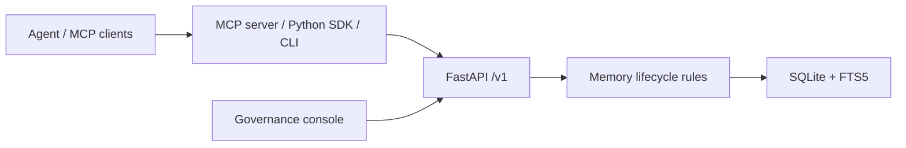

# MemoryNode

> Governed Memory Infrastructure for AI Agents.

MemoryNode turns agent interactions into reviewable memory proposals—not silent, durable facts. A reviewer decides what becomes trusted; agents can then search, explain, and work with that governed memory through a local Python package, CLI, SDK, and MCP.


## Why governed memory?

An agent can extract a useful preference or project decision from a conversation, but that does not make it safe to retain as a trusted fact. Without a lifecycle, temporary context can become opaque, stale, or impossible to remove.

MemoryNode makes each durable memory an explicit, evidence-backed decision:

```text
extract -> approve/reject -> search -> explain -> revoke/expire/supersede -> audit
```

- Agents submit pending proposals by default; they do not directly create trusted durable memories.
- Every approved memory retains source evidence, a rationale, lifecycle state, and audit events.
- Revocation, expiry, and reviewer-selected supersession remove memories from default retrieval while preserving their history.

MemoryNode is a local governed-memory layer. It is not a chatbot, an agent framework, a vector database, or a hosted platform.

## What it does

| Capability | What it guarantees |
| --- | --- |
| Proposal extraction | Qwen-compatible extraction produces structured, pending proposals with source evidence. |
| Human review | A reviewer explicitly approves or rejects each proposal. |
| Trusted retrieval | SQLite FTS5 searches active, effective memories by default. |
| Explanation | A memory can be traced to its source, proposal, decision, relationships, and events. |
| Lifecycle control | Active memories can be revoked, expired on a relevant request, or superseded by reviewer choice. |
| Local integration | Python SDK, CLI, stdio MCP, and token-protected local HTTP MCP use the same FastAPI boundary. |

Related memories are reviewer candidates, not automatic semantic conflict arbitration. Expiry is request-driven; there is no background scheduler.

## Quick start

MemoryNode `0.7.0` is published as the `memorynode` Python package.

```bash
uv tool install memorynode
memorynode init
memorynode start
memorynode status
memorynode doctor
```

Open the local governance console at `http://127.0.0.1:3000/`. The FastAPI API defaults to `http://127.0.0.1:8000`.

The installed runtime includes the FastAPI backend, static governance console, SDK, CLI, stdio MCP, and local HTTP MCP. It does not require a Git checkout, Node.js, npm, `node_modules`, or `.next`.

When you are finished:

```bash
memorynode stop
```

## Try the lifecycle

1. Create a manual proposal or extract proposals from a transcript.
2. Review its content, type, confidence, source quote, and rationale.
3. Approve one proposal; it becomes an active memory. Reject another; no memory is created.
4. Search the active memory, then use explain to view its source and audit trail.
5. Revoke it and confirm it is excluded from default search while remaining auditable.


## MCP

### Stdio MCP

Use the default stdio transport in an MCP client. Standard output is reserved for MCP protocol frames.

```json
{
  "mcpServers": {
    "memorynode": {
      "command": "memorynode",
      "args": ["mcp"]
    }
  }
}
```

The default tools let an agent propose, search, retrieve, explain, list, and submit feedback. Governance-changing tools are hidden unless explicitly enabled through local configuration.

### Local HTTP MCP

For multiple local MCP clients, start MemoryNode and then run the shared endpoint in a separate foreground terminal:

```powershell
memorynode start
memorynode mcp --transport http --host 127.0.0.1 --port 8765
```

Connect to `http://127.0.0.1:8765/mcp` with `Authorization: Bearer <token>`. `memorynode init` prints the high-entropy token once and only its SHA-256 hash is persisted in local `config.toml`; store the printed token securely. A lost token can be rotated with:

```powershell
memorynode mcp --transport http --print-token-once
```

HTTP MCP is loopback-only and rejects missing or invalid bearer tokens before MCP tools or resources run.

## CLI operations

| Command | Purpose |
| --- | --- |
| `memorynode init` | Create local configuration and directories; print the HTTP MCP token once. |
| `memorynode start`, `stop`, `restart`, `status` | Manage only verified API and console processes recorded by MemoryNode. |
| `memorynode doctor` | Perform read-only installation, process, database, configuration, and MCP checks without printing secret values. |
| `memorynode backup`, `restore`, `export`, `import` | Safeguard or transfer local data; backups and exports can contain sensitive memory content. |
| `memorynode mcp` | Run stdio MCP or the local token-protected HTTP transport. |
| `memorynode version` | Print the installed distribution version. |

Use `memorynode --help` or `memorynode <command> --help` for flags. Import and restore require a stopped, verified installation and explicit confirmation.

## Architecture



FastAPI `/v1` owns business rules and lifecycle state. SQLite is the local source of truth and FTS5 is the default keyword search layer. The SDK and MCP server are clients/adapters: neither directly accesses SQLite.

## Security and privacy defaults

- The API, console, and local HTTP MCP bind only to `127.0.0.1`.
- HTTP MCP is bearer-token protected; only the token hash is stored.
- Local databases, backups, and JSONL exports can contain sensitive source text, proposals, memories, and events. Keep them in a private location and out of source control.
- Sanitized `mcp.log` records operation names, outcomes, timing, request IDs, and token fingerprints only. It must not contain bearer tokens, Authorization headers, memory content, queries, request parameters, or response content.
- Repository `.env` files are not loaded by the installed runtime. Provide model credentials through your environment or an approved local secret mechanism.

See [SECURITY.md](SECURITY.md) and [TROUBLESHOOTING.md](TROUBLESHOOTING.md) for operating guidance.

## API surface

| Area | `/v1` endpoints |
| --- | --- |
| Proposals | `POST /proposals/extract`, `POST /proposals`, `GET /proposals`, `GET /proposals/{id}`, approve, reject, and related-memory candidates |
| Memories | list, FTS5 search, get, explain, revoke, feedback, and expiry |
| Evidence and audit | sources plus recent or individual events |

The API is the lifecycle boundary: writes create auditable transitions, and default search returns active, effective memories.

## Source development

Use the package above to run MemoryNode locally. The following setup is for contributors working from source only:

```bash
git clone https://github.com/unnoderes/MemoryNode.git
cd MemoryNode
cd backend && python -m pip install -r requirements.txt
python -m uvicorn app.main:app --reload
```

In another terminal, build the local governance console:

```bash
cd frontend
npm install
npm run dev
```

Keep model credentials outside the repository. Do not place real secrets in examples, diagnostics, or committed files.

## Verification and release notes

For source verification:

```bash
cd backend && python -m pytest -q
cd ../frontend && npm run build
```

Release artifacts are produced by `python scripts/build_release.py`; see [RELEASING.md](RELEASING.md) for the gated procedure. The current release is `memorynode==0.7.0`.

## Scope and non-goals

MemoryNode intentionally proves governed local memory before adding infrastructure. It does not provide cloud hosting, remote accounts, billing, multi-tenant operation, Docker deployment, LAN exposure, a general agent framework, vector search, automatic approval, automatic conflict arbitration, or a background expiry scheduler.

## License

[MIT](LICENSE)
