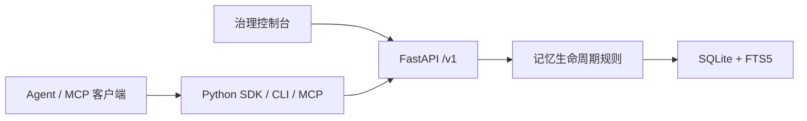

# MemoryNode

[English](README.md) | [简体中文](README.zh-CN.md)

> 让 AI 记得住，也管得住。

MemoryNode 是面向 AI Agent 的本地记忆基础设施。它不会让模型把一段对话悄悄变成长期事实：AI 只能提交候选记忆，**由人决定是否保存**。一旦保存，记忆仍然可以搜索、追溯、替换、到期或撤销。


## 一句话说明白

**先提案，后审核；能检索，也能追溯；可撤销，不失控。**

```text
对话 / 内容 → 记忆提案 → 人工审核 → 可用记忆 → 检索、解释与审计
                                  ↓
                           拒绝 / 撤销 / 到期 / 替换
```

MemoryNode 适合希望让 Agent 具备长期记忆、但不愿把控制权交给模型的本地应用。它不是聊天机器人、Agent 框架、向量数据库或云端 SaaS。

## 它能做什么

| 你关心的事 | MemoryNode 的做法 |
| --- | --- |
| AI 会不会擅自记住内容？ | 不会。提取结果默认进入待审核队列。 |
| 这条记忆从哪来？ | 每条已批准记忆都保留来源、提案、审核决定和事件记录。 |
| 旧信息会不会一直干扰回答？ | 可撤销、设置到期时间，或由审核者明确替换。默认搜索只返回当前有效的记忆。 |
| 能不能给多个 Agent 用？ | 可以。Python SDK、CLI 和 MCP 都通过同一套 FastAPI 接口工作。 |
| 数据会不会离开电脑？ | 默认不会。服务、控制台和 HTTP MCP 都只监听 `127.0.0.1`，数据保存在本地 SQLite。 |

相关记忆只用于帮助审核者发现可能重复或冲突的内容；系统不会替你自动裁决。到期状态按请求处理，不依赖后台定时任务。

## 看一眼实际界面

审核时，先看内容、原文和提取理由，再决定批准或拒绝。模型置信度只是参考，不是自动保存的依据。


批准后的记忆可以按关键词搜索；已撤销、已过期或被替换的内容默认不会混入结果。


## 快速开始

MemoryNode 以 `memorynode` Python 包运行，需要 Python 3.10 或更高版本。

```bash
uv tool install memorynode
memorynode init
memorynode start
memorynode status
```

打开治理控制台：<http://127.0.0.1:3000/>

API 默认地址：<http://127.0.0.1:8000>

首次执行 `memorynode init` 时会创建本地目录和配置，并只显示一次 HTTP MCP 的访问令牌。请立即妥善保存它。

完成后可停止本地服务：

```bash
memorynode stop
```

安装版已包含 FastAPI 后端、治理控制台、SDK、CLI、stdio MCP 和本地 HTTP MCP；正常使用不需要 Git、Node.js 或前端构建环境。

## 使用流程

1. 把一段对话交给模型提取，或通过 API 创建一条手工提案。
2. 在控制台核对内容、类型、来源摘录、提取理由和置信度。
3. 批准后生成有效记忆；拒绝后不生成记忆。
4. 需要时搜索记忆，并使用解释接口查看来源和完整变更记录。
5. 信息不再适用时，撤销、设置到期，或批准新提案来替换旧记忆。

提取功能使用 Qwen 兼容接口。运行前按需提供 `QWEN_API_KEY`、`QWEN_BASE_URL` 和 `QWEN_MODEL` 等环境变量；详情可参考 [.env.example](.env.example)。不要把真实密钥提交到仓库。

## MCP：让 Agent 在边界内使用记忆

### Stdio MCP

将下面的配置加入 MCP 客户端。标准输出保留给 MCP 协议，请不要把调试日志写到标准输出。

```json
{
  "mcpServers": {
    "memorynode": {
      "command": "memorynode",
      "args": ["mcp"]
    }
  }
}
```

默认可用工具包括：提交记忆提案、搜索、读取、解释、列出记忆和提交反馈。批准、拒绝、撤销、替换、设置到期等会改变治理状态的工具，默认隐藏，只有本地管理员在配置中显式开启后才会暴露。

### 本地 HTTP MCP

需要多个本地 MCP 客户端共享服务时，在另一个前台终端运行：

```powershell
memorynode start
memorynode mcp --transport http --host 127.0.0.1 --port 8765
```

连接地址为 `http://127.0.0.1:8765/mcp`，请求需带上 `Authorization: Bearer <token>`。令牌只保存 SHA-256 哈希；如果遗失，可重新生成并只显示一次：

```powershell
memorynode mcp --transport http --print-token-once
```

HTTP MCP 强制限制在回环地址，并在执行 MCP 工具前校验令牌。

## 常用命令

| 命令 | 用途 |
| --- | --- |
| `memorynode init` | 初始化本地配置、数据目录和 HTTP MCP 令牌。 |
| `memorynode start` / `stop` / `restart` / `status` | 管理 MemoryNode 自己启动并记录的 API 与控制台进程。 |
| `memorynode doctor` | 只读检查安装、配置、进程、数据库与 MCP 状态，不打印密钥。 |
| `memorynode backup` / `restore` | 备份或恢复本地 SQLite 数据库。恢复需要服务停止和 `--confirm`。 |
| `memorynode export` / `import` | 导出或导入 JSONL 数据。导入需要服务停止和 `--confirm`。 |
| `memorynode mcp` | 启动 stdio MCP 或受令牌保护的本地 HTTP MCP。 |
| `memorynode version` | 输出已安装版本。 |

使用 `memorynode --help` 或 `memorynode <命令> --help` 查看全部参数。备份和导出可能包含对话原文与记忆内容，请按敏感数据处理。

## 架构



FastAPI `/v1` 是唯一的业务与生命周期边界。SQLite 是本地事实源，FTS5 提供默认关键词检索。SDK 和 MCP 是 API 客户端，不直接读写数据库。

主要接口覆盖：

- 提案：创建、提取、查看、批准、拒绝和查找相关记忆；
- 记忆：列表、搜索、读取、解释、反馈、撤销和设置到期；
- 审计：来源记录与最近或指定事件。

## 安全与隐私

- API、控制台和 HTTP MCP 默认只监听 `127.0.0.1`。
- HTTP MCP 使用 Bearer Token 认证，磁盘上只保存令牌哈希。
- 本地数据库、备份和 JSONL 导出都可能包含原始对话、提案、记忆和审计记录；请存放在私密目录，不要提交到版本库。
- MCP 日志只记录操作名、结果、耗时、请求 ID 和令牌指纹，不应记录令牌、Authorization 头、查询词、请求参数或记忆内容。
- 已安装运行时不会自动读取仓库 `.env` 文件；请通过环境变量或你认可的本地密钥机制提供模型凭据。

## 从源码开发

下面的步骤只面向贡献者；日常使用请安装发布包。

```bash
git clone https://github.com/unnoderes/MemoryNode.git
cd MemoryNode
cd backend
python -m pip install -r requirements.txt
python -m uvicorn app.main:app --reload
```

另开一个终端启动治理控制台：

```bash
cd frontend
npm install
npm run dev
```

验证改动：

```bash
cd backend && python -m pytest -q
cd ../frontend && npm run build
```

发布构建使用：

```bash
python scripts/build_release.py
```

## 当前边界

MemoryNode 专注于可验证的本地治理闭环。目前不提供云托管、远程账号、多租户、账单、Docker 部署、局域网暴露、自动批准、自动冲突裁决、向量搜索或后台到期调度。

## License

[MIT](LICENSE)
