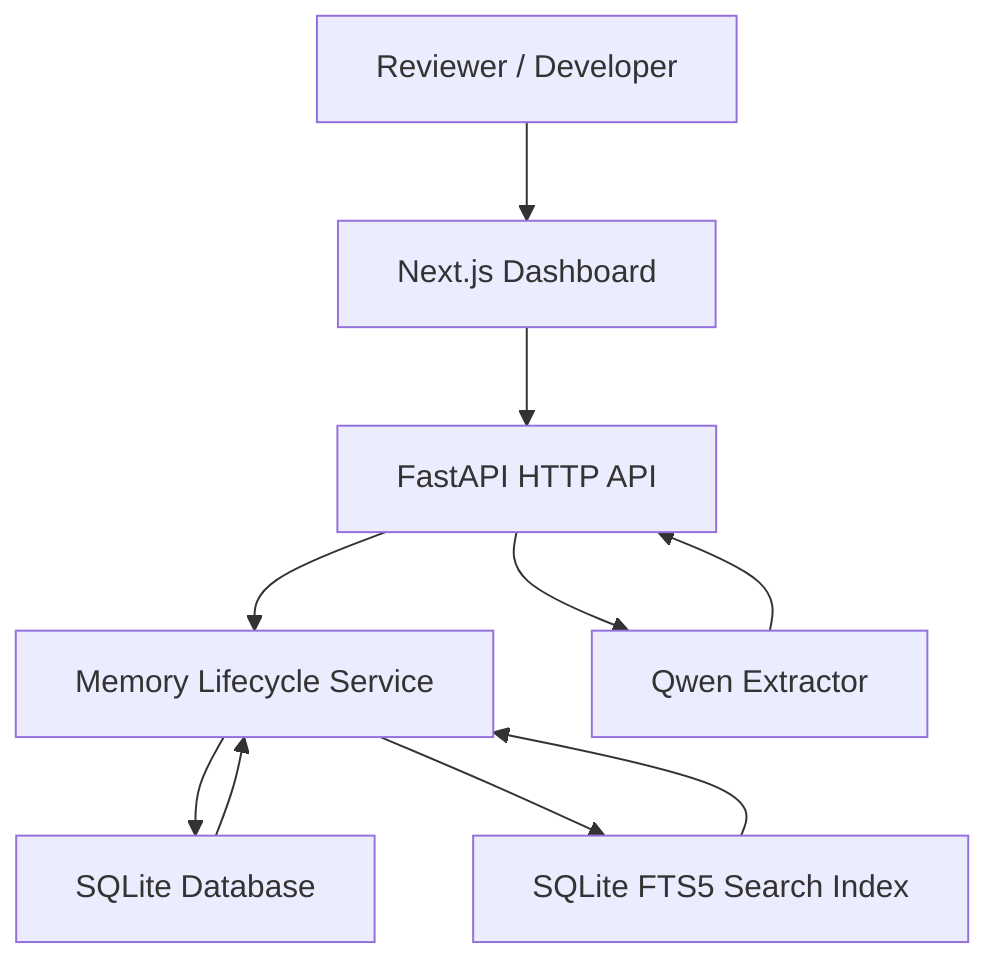

# MemoryNode Architecture

## Diagram

## Core Components

- Next.js Dashboard: local browser UI for proposal review, related-memory review,
  optional expiry, memory search, explanation, and revoke.
- FastAPI HTTP API: owns the public MVP API surface.
- Memory Lifecycle Service: enforces proposal and memory state transitions.
- Qwen Extractor: turns raw transcripts into candidate memory proposals when configured.
- SQLite: stores sources, proposals, memories, and audit events.
- SQLite FTS5: searches approved active memory content for the MVP.

## Data Flow

1. A reviewer submits a transcript from the dashboard.
2. The API sends the transcript to the Qwen extractor.
3. Extracted candidates are stored as pending proposals with source evidence.
4. The reviewer approves or rejects proposals.
5. Approved proposals create active memories and audit events.
6. Search returns active, non-revoked, non-expired memories by default.
7. Explain returns the memory, source quote, reason, proposal, and event history.
8. Revoke changes the memory status and removes it from default search results.

## Supersession And Expiry

`GET /v1/proposals/{id}/related-memories` returns active memories with the same
actor, project, and type as the pending proposal. These are reviewer-facing
candidates, not an automatic semantic-conflict decision. When the reviewer
supplies one eligible `supersede_memory_id` at approval, the new memory becomes
active, the old memory becomes revoked, and both records receive linked audit
events and explainable relationships.

An approval may include a future, timezone-aware `expires_at`. Relevant
requests refresh due active memories: they transition once to `expired`, receive
an `expire` audit event, and disappear from default search. This is deliberately
request-driven; there is no background scheduler or worker.

## Why SQLite and FTS5 First

SQLite keeps the MVP small, local, and easy to demo. It avoids operating a
separate database service while the product rules are still being validated.
FTS5 is enough for keyword search over approved memory content and lets the MVP
prove the governed lifecycle before adding vector infrastructure.

## Future Upgrade Path

The backend API is the boundary. Later versions can keep the dashboard and
client contracts thin while replacing storage/search internals:

- Use Qwen Cloud for production extraction and classification.
- Move durable records from SQLite to Postgres.
- Add pgvector or Qwen embeddings for semantic search.
- Keep approval, explanation, revocation, and audit events as first-class rules.

