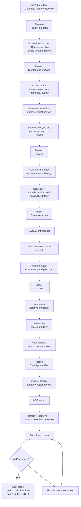

# MemoryNode MVP Development Flow

```mermaid
flowchart TD
    A["MVP boundary<br/>Governed memory lifecycle"] --> B["Phase 0<br/>Project skeleton"]
    B --> C["Backend health check<br/>SQLite connection<br/>empty frontend routes"]

    C --> D["Phase 1<br/>Storage and lifecycle"]
    D --> E["Create tables<br/>sources, proposals, memories, events"]
    E --> F["Implement transitions<br/>approve, reject, revoke"]
    F --> G["Backend lifecycle test<br/>approve -> search -> revoke"]

    G --> H["Phase 2<br/>Search"]
    H --> I["SQLite FTS5 index<br/>active-memory filtering"]
    I --> J["Search API<br/>exclude revoked and expired by default"]

    J --> K["Phase 3<br/>Qwen extraction"]
    K --> L["Qwen client wrapper"]
    L --> M["Strict JSON extraction prompt"]
    M --> N["Validate output<br/>store source and proposals"]

    N --> O["Phase 4<br/>Dashboard"]
    O --> P["/proposals<br/>approve and reject"]
    P --> Q["/memories<br/>search and filter"]
    Q --> R["/memories/:id<br/>source, events, revoke"]

    R --> S["Phase 5<br/>Thin Python SDK"]
    S --> T["extract, search,<br/>approve, reject, revoke"]

    T --> U["MVP demo"]
    U --> V["extract -> approve -> search -> explain -> revoke"]
    V --> W["Acceptance check"]

    W --> X{"MVP accepted?"}
    X -- "yes" --> Y["Next stage<br/>pgvector, MCP adapter,<br/>hooks, auth, TS SDK"]
    X -- "no" --> Z["Fix failed acceptance item"]
    Z --> W
```
